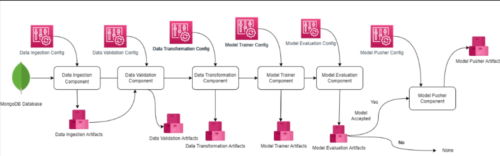
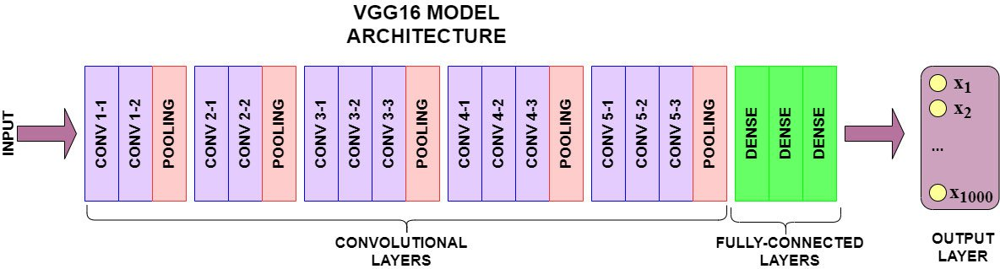
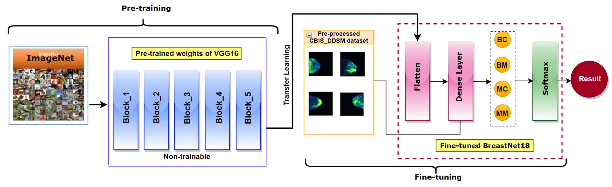
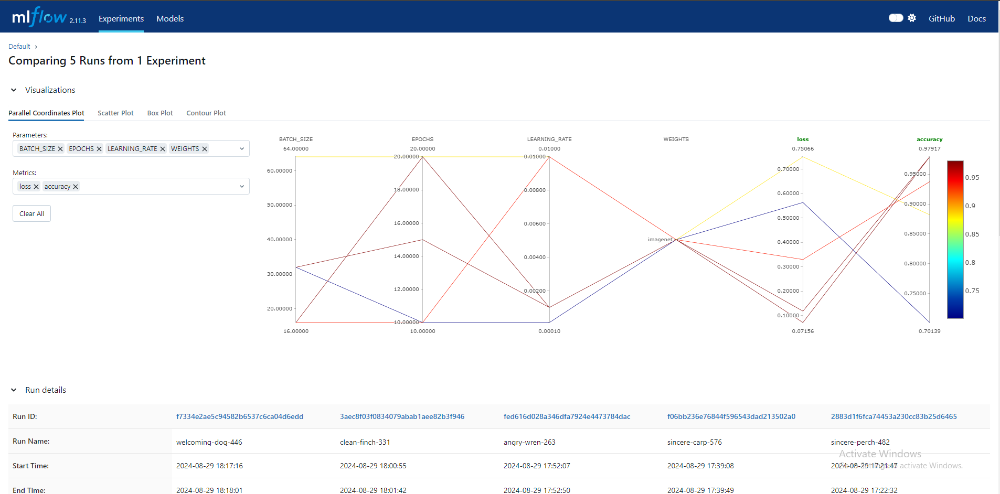
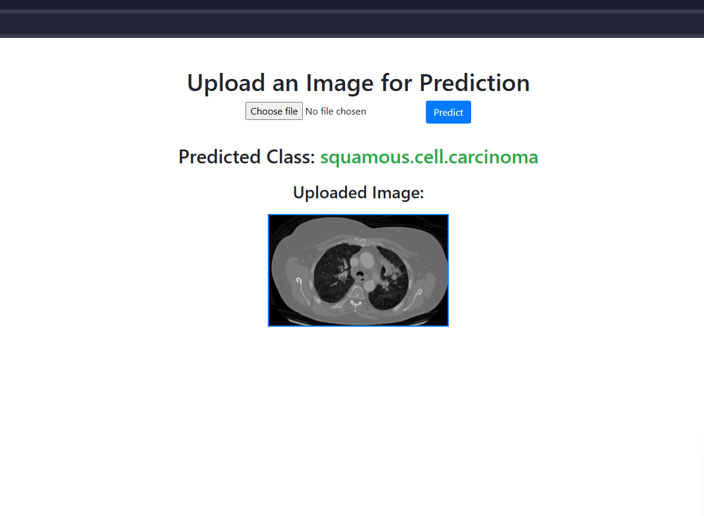

# End-toEnd Data Science Project with Transfer Learning and MLOps

This project focuses on developing an end-to-end multi-class Image Classification with production-ready code. It integrates MLOps practices for robust and reproducible model development, deployment, and monitoring.

## Project Overview

- **Data Source**: Chest cancer images from Kaggle.
- **Model**: VGG16 with a transfer learning approach.
- **Workflow**:
  
  - **Data Ingestion**: Automated data ingestion pipeline that imports images from **MongoDB**.
  - **Training**: Automated model training pipeline that downloads VGG16 base-model from Tensorflow Hub and modifies it for further fine-tuning .
  - **Evaluation**: Automated model evaluation pipeline with model tracking using **MLFlow**.
  - **Prediction**: Prediction pipeline with **Flask** app that uses trained model for predicting user inputs.
  - **CI/CD** and **Cloud Deployment**: App is deployed on **AWS EC2** instance, ensuring scalability and high availability. The deployment process is automated using **Docker** and **GitHub Actions** for seamless updates and maintenance.

## VGG16 Architecture

- VGG16 is a convolutional neural network (CNN) model trained on ImageNet dataset. The architecture consists of blocks of convolutional layers, followed by max-pooling layers for down-sampling

1. Input Layer: Accepts images of size 224x224x3.
2. Convolutional Layers:
  - Block 1: Two 3x3 convolutions (64 filters), followed by a max-pooling layer.
  - Block 2: Two 3x3 convolutions (128 filters), followed by a max-pooling layer.
  - Block 3: Three 3x3 convolutions (256 filters), followed by a max-pooling layer.
  - Block 4: Three 3x3 convolutions (512 filters), followed by a max-pooling layer.
  - Block 5: Three 3x3 convolutions (512 filters), followed by a max-pooling layer.
3. Fully Connected Layers: Flattened output is passed to two fully connected layers with 4096 units each, and a final softmax layer with 1000 outputs.
4. Output Layer: Predicts probabilities for 1000 ImageNet classes.

## VGG16 Fine-Tuning


1. Imported a pre-trained version of VGG16 from Keras.
2. Freeze the weights of the initial convolutional layers to preserve the learned low-level features (like edges and textures).
3. Replace Fully Connected Layers
4. Re-train the model on the new dataset.
5. Use techniques like data augmentation and early stopping to improve model generalization and avoid overfitting.


## MLOps Tools and Techniques

- **MLflow**: Used for tracking experiments and hyperparameter tuning.
  

- **DAGsHub**: Visualized data pipeline for streamlined data processing and management.

- **DVC (Data Version Control)**: Implemented for data versioning to ensure reproducibility.

- **Flask Application**: Built a web app to provide an interface for users to upload images and receive predictions.
  

- **Docker**: Dockerized the application for consistent deployment across environments.

- **GitHub Actions**: Implemented CI/CD pipelines for continuous integration and deployment.

- **AWS EC2**: Deployed the application on AWS for scalable access.

## Result

- Successfully implemented the project by integrating Transfer Learning and MLOps techniques.
- Obtained model accuracy of ~95% and loss of ~0.06

## To run the project

To get started with this project, follow these steps:

1. Clone the repository:  
   ```bash
   git clone https://github.com/SathvikNayak123/cancer-dl.git
   ```
2. Install the necessary dependencies:
    ```bash
    pip install -r requirements.txt
    ```
3. Initialized DVC:
    ```bash
    dvc init
    ```
4. Training:
    ```bash
    dvc repro
    ```
5. Run app
    ```bash
    python app.py
    ```

## Workflows
For details about project and workflow and commands for AWS deployment refer below,

1. Create GitHub repo with `.gitignore`.
2. Create environment using conda
3. Set up `setup.py` if needed.
4. Install `requirements.txt`.
5. Run `template.py`.

6. Update `config/config.yaml`, `params.yaml` for hardcoded artifact paths and model parameters.
7. Update `utils/common.py` for various utility functions like save_json, read_yaml etc.
8. Update `constants/__init__.py` to initialize config.yaml and params.yaml into pipeline.

Repeat for every stage(e.g data ingestion , training, evaluation, etc):
- Update `src/config/artifacts_entity.py`.
- Update `src/configconfig_entity`.
- Update `src/components`.
- Update `src/pipeline` .
- Update `sec/pipeline/training_pipeline.py`.
- Update `main.py`.

10. Use `python main.py` to test the training pipeline.
11. Create `src/pipeline/predict_pipeline.py`.
12. Create Flask app.

13. Dockerize the application.
14. Create `.github/workflows/cicd.yaml`.

## Setup GitHub Secrets:

- `AWS_ACCESS_KEY_ID=`
- `AWS_SECRET_ACCESS_KEY=`
- `AWS_REGION=` demo>> us-east-1
- `AWS_ECR_LOGIN_URI=`   demo>> 566373416292.dkr.ecr.ap-south-1.amazonaws.com
- `ECR_REPOSITORY_NAME=` demo>> simple-app`

# AWS-CICD-Deployment-with-Github-Actions

## 1. Login to AWS console.

## 2. Create IAM user for deployment

### With specific access:

1. **EC2 access**: It is a virtual machine.
2. **ECR**: Elastic Container Registry to save your Docker image in AWS.

### Description: About the deployment

1. Build Docker image of the source code.
2. Push your Docker image to ECR.
3. Launch your EC2 instance.
4. Pull your image from ECR in EC2.
5. Launch your Docker image in EC2.

### Policy:

1. `AmazonEC2ContainerRegistryFullAccess`
2. `AmazonEC2FullAccess`

## 3. Create ECR repo to store/save Docker image

- Save the URI: `demo>> 136566696263.dkr.ecr.us-east-1.amazonaws.com/mlproject`

## 4. Create EC2 machine (Ubuntu) 

## 5. Open EC2 and Install Docker in EC2 Machine:

```bash
#optional
sudo apt-get update -y
sudo apt-get upgrade

#required
curl -fsSL https://get.docker.com -o get-docker.sh
sudo sh get-docker.sh
sudo usermod -aG docker ubuntu
newgrp docker
```

## 6. Configure EC2 as self-hosted runner:

setting >actions >runner >new self hosted runner >choose os >then run command one by one
